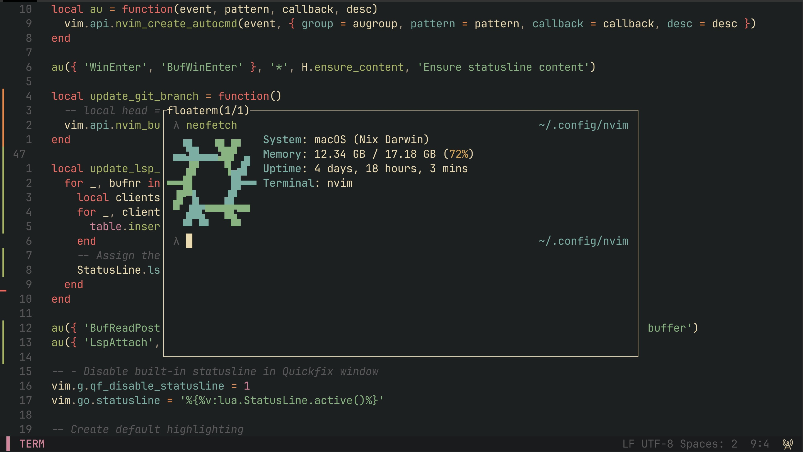

# Overview

This repository contains my personal everchanging configuration for a general-purpose development environment that runs Nix on macOS, NixOS, or any other Linux (yet to be done). Due to limitations both Windows and WSL are not supported and likely will never be.

## Features
- **Nix Flakes**: 100% flake driven, no `configuration.nix`, no Nix channels ─ just `flake.nix`
- **Managed Homebrew**: Zero maintenance homebrew environment 
- **Consistent Environment**: Easily share config across Linux and macOS (both Nix and Home Manager)
- **Nix Darwin**: Fully declarative macOS (Apple / Intel) w/ UI, dock and macOS App Store apps
- **Neovim**: IDE-like experience with LSP, Treesitter and more

## Components

| Component                   | Description                                     | 
| --------------------------- | :---------------------------------------------  |
| **Window Manager**          | Amethyst + skhd                                 |
| **Terminal Emulator**       | Wezterm                                         |
| **Text Editor**             | neovim                                          |
| **Application Launcher**    | Raycast                                         |
| **File Manager**            | yazi                                            |


# Installation (macOS)

1. Install xcode dependencies and [homebrew](https://brew.sh/)
```bash
xcode-select --install
/bin/bash -c "$(curl -fsSL https://raw.githubusercontent.com/Homebrew/install/HEAD/install.sh)"
```

2. Install [nix](https://nixos.org/download.html)
```bash
sh <(curl -L https://nixos.org/nix/install)
```

3. Clone this repo
```bash
git clone https://github.com/pluresque/dotfiles.git
```

Feel free to move folders wherever you want. Once you're done, just run `nix build` to build the configuration.
